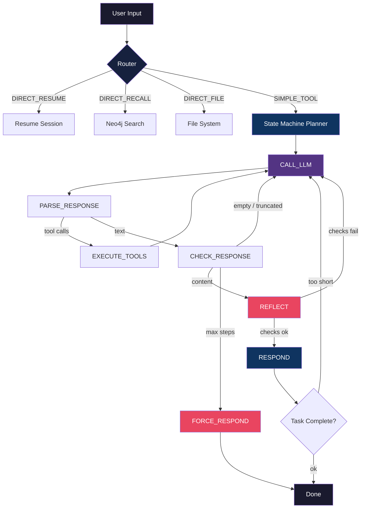
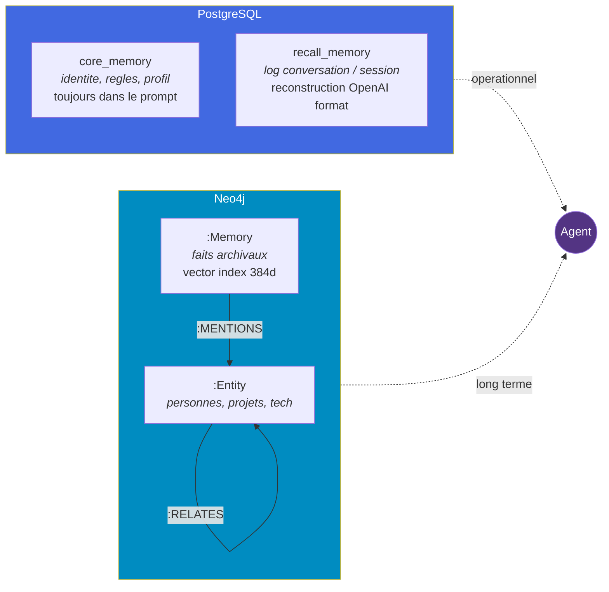
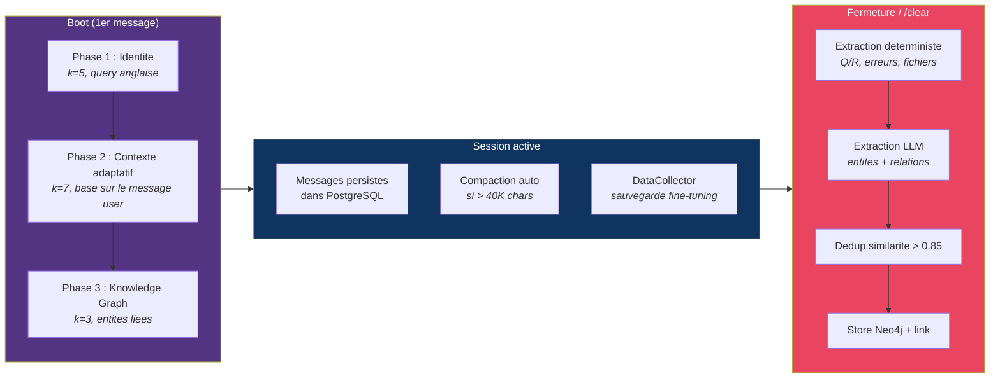

<div align="center">


# Setharkk

**Agent IA autonome local avec memoire long terme et knowledge graph**

[](https://python.org)
[](https://huggingface.co/Qwen/Qwen3.5-9B)
[](https://neo4j.com)
[](https://postgresql.org)

---

Setharkk tourne **100% en local** sur un GPU consumer (RTX 3060 12 Go).<br/>
Il raisonne, utilise des outils, apprend de ses conversations, et construit un graphe de connaissances.<br/>
Zero API cloud. Zero cle API. Zero donnees envoyees a l'exterieur.

</div>

---

## Architecture



**7 etats** : `CALL_LLM` > `PARSE_RESPONSE` > `EXECUTE_TOOLS` > `CHECK_RESPONSE` > `REFLECT` > `RESPOND` > `FORCE_RESPOND`

Le **Router** intercepte les cas simples sans appeler le LLM (recall memoire, lecture fichier, listing dossier, reprise de session). Tout le reste passe par le planner.

**Specifique Qwen 3.5 9B** : le planner inclut un parseur XML fallback pour les tool calls que Qwen met parfois dans le `content` au lieu du format natif.

---

## Memoire Hybride



### Scoring composite

Chaque souvenir dans Neo4j est classe par un score composite (configurable dans `agent.yaml`) :

| Signal | Poids | Methode |
|:-------|:-----:|:--------|
| Similarite vectorielle | `0.55` | Cosine distance via vector index Neo4j (FastEmbed bge-small-en-v1.5, 384d) |
| Importance | `0.15` | Deterministe par categorie : error=0.9, decision=0.8, skill=0.7, preference=0.6, fact=0.5 |
| Recency | `0.15` | Decay hyperbolique `1/(1+jours)` depuis le dernier acces |
| Frequence | `0.15` | Compteur d'acces normalise, plafonne a 20 |

### Knowledge Graph

Le graphe Neo4j stocke des **entites** (personnes, projets, technologies, concepts) et leurs **relations** :

- `add_entity()` -- upsert avec MERGE Cypher, garde la description la plus longue
- `add_relationship()` -- upsert, incremente le poids a chaque occurrence
- `link_memory_to_entities()` -- lie un fait a ses entites (relation `:MENTIONS`)
- `search_entities()` -- recherche textuelle par nom/description
- `get_neighbors()` -- traversee Cypher multi-hop
- `get_subgraph()` -- recherche + traversee + faits lies

### Cycle de vie



La **dedup par similarite** (seuil 0.85) empeche les doublons entre sessions. L'**extraction LLM** est optionnelle (si le serveur LLM est arrete, l'extraction deterministe fonctionne seule).

---

## Tools (12)

| | Tool | Type | Description |
|:--|:-----|:-----|:-----------|
| :mag: | `search` | Primitif | DuckDuckGo async (via `asyncio.to_thread`) |
| :open_file_folder: | `file_system` | Primitif | Read / write / list / search / replace (max 80K chars) |
| :snake: | `code_executor` | Primitif | Python subprocess isole avec timeout |
| :globe_with_meridians: | `browser` | Primitif | Camoufox Docker, extraction contenu intelligent (article/main, suppression nav/footer/ads) |
| :brain: | `remember` | Memoire | Stocke un fait dans Neo4j avec embedding + importance auto |
| :dart: | `recall` | Memoire | Recherche vectorielle Neo4j avec scoring composite |
| :wastebasket: | `forget` | Memoire | Suppression par similarite vectorielle |
| :pencil2: | `core_memory_update` | Memoire | Mise a jour identite / regles / profil (PostgreSQL) |
| :scroll: | `search_history` | Memoire | Recherche cross-session (texte ILIKE + semantique Neo4j) |
| :spider_web: | `graph_recall` | Memoire | Traversee knowledge graph Neo4j (entites + relations + faits lies) |
| :microscope: | `research` | Compound | Search + browse 5 pages + synthese LLM (timeout 180s) |
| :mag_right: | `review_code` | Compound | Analyse statique + review LLM par batch de 80K chars (timeout 300s) |

Tous les seuils et timeouts sont dans `configs/agent.yaml`. Zero hardcode.

---

## Reflexion Heuristique (4 niveaux)

> *Pas de LLM-as-judge : un 9B qui juge sa propre sortie cause la "degeneration of thought" et degrade le win rate ([arxiv 2604.07236](https://arxiv.org/html/2604.07236)). Tous les checks sont deterministes.*

| Niveau | Ou | Checks |
|:-------|:---|:-------|
| **Step** | Planner `REFLECT` | Ratio reponse/tools < 5% · Grounding mots-cles des resultats · Pertinence vs question originale · Tags XML orphelins (Qwen 3.5) |
| **Task** | Agent post-planner | Reponse vide · Question complexe (verbes d'action FR/EN) vs reponse < 300 chars |
| **Tool** | ResearchTool, BrowserTool | Topic absent de la synthese · Contenu extrait < 50 chars |
| **Memory** | SessionExtractor | Fait < 30 chars filtre · Entite "concept" sans description filtree · snake_case et mots generiques filtres |

Max 1 reflexion par run au niveau planner, max 1 relance au niveau agent. Pas de boucle infinie.

---

## Context Manager

Gere le budget tokens automatiquement pendant la conversation :

- **Compaction** : si le contexte depasse 40K chars, les anciens messages sont compresses en resume deterministe (objectif/actions/progres) et sauvegardes en Neo4j
- **Truncation tool results** : les anciens resultats de tools sont tronques a 5K chars, les 6 derniers messages sont preserves intacts
- **Summary dans le prompt** : le resume est injecte DANS le system message (Qwen `--jinja` exige un seul message system)

---

## Interfaces

### CLI (`python main.py`)

Terminal Rich avec commandes slash :

| Commande | Action |
|:---------|:-------|
| `/tools` | Liste les 12 tools disponibles |
| `/memory` | Affiche les 5 derniers messages de session |
| `/status` | Core memory + tools + session ID |
| `/clear` | Nouvelle session (auto-save avant reset) |
| `/exit` | Fermeture (auto-save + extraction) |
| `/file <path>` | Charge un prompt depuis un fichier |

### Web (`python web_main.py`)

FastAPI + WebSocket sur `http://127.0.0.1:8090`. Chaque connexion WebSocket obtient son propre Agent + Memory isoles (multi-session).

---

## Dual Model Support

| | Qwen 3.5 9B | Qwen 3.5 35B-A3B |
|:--|:------------|:-----------------|
| Script | `start_server.bat` | `start_server_35b.bat` |
| Config | `model.yaml` | `model_35b.yaml` |
| VRAM | ~6 Go | ~12 Go (+ RAM offload) |
| Contexte | 131K tokens | 32K tokens |
| Vitesse | ~50 t/s | ~10-20 t/s |
| Qualite | Bonne | Superieure |
| Architecture | Dense, 9B actifs par token | Mixture-of-Experts, 3B actifs par token sur 35B total |

Le 9B est le modele par defaut (rapide, contexte large). Le 35B-A3B est disponible pour les taches complexes.

---

## DataCollector (Fine-tuning)

Chaque interaction est sauvegardee automatiquement en format ChatML dans `training/data/interactions.jsonl`. Ces donnees peuvent etre utilisees pour un LoRA fine-tuning via Unsloth.

---

## Interface Web

Application single-page (1430 lignes HTML/CSS/JS) avec :

- Chat en temps reel via WebSocket
- Affichage des etapes d'execution (THINK / ACT / OBSERVE / RESPONSE)
- Upload de fichiers comme prompt
- Commandes slash intégrées
- Multi-session isole (chaque connexion a son propre Agent + Memory)

### Pipeline Fine-tuning

Le systeme collecte automatiquement les interactions pour un futur LoRA fine-tuning :

```
training/
|-- finetune.py              QLoRA via Unsloth (Qwen 3.5)
|-- merge_and_export.py      Fusion LoRA + export GGUF
+-- data/
    |-- interactions.jsonl    260+ interactions reelles (ChatML)
    +-- synthetic_examples.jsonl  49 exemples synthetiques
```

`finetune.py` lance un QLoRA sur les interactions collectees. `merge_and_export.py` fusionne le LoRA avec le modele de base et exporte en GGUF quantise pret pour llama.cpp.

---

## Structure

```
setharkk/
|-- main.py                          Entry point CLI
|-- web_main.py                      Entry point FastAPI
|-- docker-compose.yml               Neo4j container
|-- configs/
|   |-- agent.yaml                   Config complete (100% config-driven)
|   |-- model.yaml                   Qwen 3.5 9B
|   +-- model_35b.yaml              Qwen 3.5 35B-A3B (alternative)
|-- agent/
|   |-- core/
|   |   |-- agent.py                 Agent + boot 3 phases + resume + task check
|   |   |-- planner.py              State machine (7 etats + REFLECT)
|   |   |-- memory.py               PostgreSQL + Neo4j + KG + SessionExtractor
|   |   |-- context_manager.py      Budget tokens + compaction + truncation
|   |   |-- router.py               Classification intent (5 intents)
|   |   +-- data_collector.py       Sauvegarde ChatML pour fine-tuning
|   |-- models/
|   |   |-- local_model.py          Client llama-server (chat + chat_with_tools + stream)
|   |   +-- prompts.py              System prompt dynamique (tools depuis ToolRegistry)
|   |-- tools/                       12 tools (8 fichiers)
|   +-- ui/
|       +-- cli.py                   CLI Rich avec commandes slash
+-- web/
|   |-- server.py                    FastAPI + WebSocket (multi-session isole)
|   +-- index.html                   Interface web
+-- training/
|   |-- finetune.py                  QLoRA fine-tuning via Unsloth
|   |-- merge_and_export.py          Fusion LoRA + export GGUF
|   +-- data/                        Interactions collectees (ChatML)
+-- scripts/
    |-- start_server.bat             Lancement 9B
    |-- start_server_35b.bat         Lancement 35B-A3B
    |-- build_llama.bat              Compilation llama.cpp depuis source
    |-- quantize_model.bat           Quantization GGUF (F16 -> Q4_K_M)
    |-- setup_db.py                  Init PostgreSQL
    |-- migrate_memory_v2.py         Migration memoire v1 -> v2
    |-- migrate_archival_to_neo4j.py Migration PostgreSQL -> Neo4j
    +-- cleanup_pgvector.py          Nettoyage ancien backend pgvector
```

---

## Config-Driven

**Toutes les valeurs** sont dans `configs/agent.yaml`. Zero constante hardcodee.

<details>
<summary><b>Sections configurables (cliquer pour ouvrir)</b></summary>

| Section | Contenu |
|:--------|:--------|
| `agent` | Iterations max (50), tool timeout (30s) |
| `memory.postgres` | Connexion PostgreSQL |
| `memory.neo4j` | Connexion Neo4j |
| `memory.scoring` | Poids similarite/importance/recency/frequence |
| `memory.knowledge_graph` | Extraction timeout, max entites |
| `memory.extractor` | Seuils dedup, longueur min faits/entites |
| `context_manager` | Seuils compaction (40K), keep recent (8), truncation (5K) |
| `browser` | Timeouts navigation (30s), extraction max (50K chars) |
| `tools.defaults` | Search (10 resultats), code timeout (30s), graph depth (1-3) |
| `tools.file_system` | Read max (80K), list max (100), search max (50) |
| `tools.research` | Browse pages (5), chars (20K), timeouts, compound (180s) |
| `tools.code_review` | Batch budget (80K), max lines (500), compound (300s) |
| `boot` | Identity k (5), context k (7), graph k (3), max merged (10) |
| `resume` | Min messages (3), last N (15) |
| `reflection` | Completude ratio (0.05), grounding matches (2), task min (300 chars) |

</details>

---

## Prerequis

| | Composant | Version | Utilisation |
|:--|:----------|:--------|:-----------|
| :snake: | Python | 3.11+ | Runtime |
| :elephant: | PostgreSQL | 15+ | Core memory + recall |
| :whale: | Docker | 24+ | Neo4j + Camoufox |
| :llama: | llama.cpp | Latest | Inference LLM (`--jinja`) |
| :video_game: | GPU | 12 Go VRAM min | Qwen 3.5 9B Q4_K_M |
| :desktop_computer: | RAM | 16 Go min | Systeme + Neo4j |

## Lancement

```bash
# Infrastructure
docker compose up -d                    # Neo4j

# Serveur LLM
scripts/start_server.bat                # Qwen 3.5 9B sur port 8080

# Agent
python main.py                          # CLI
python web_main.py                      # Web --> http://127.0.0.1:8090
```

---

## Decisions Architecturales

| Decision | Justification |
|:---------|:-------------|
| **Mono-agent** | Token overhead x15 et erreurs x17.2 avec multi-agent sur un seul 9B ([source](https://towardsdatascience.com/the-multi-agent-trap/)) |
| **Compound tools** | Pipeline deterministe + 1 appel LLM au lieu de N sub-agents |
| **Reflexion heuristique** | LLM-as-judge degrade le win rate sur 9B ([arxiv 2604.07236](https://arxiv.org/html/2604.07236)) |
| **Neo4j unifie** | Vector search + knowledge graph dans un seul backend ([Mem0g pattern](https://docs.mem0.ai/open-source/features/graph-memory)) |
| **Prompt dynamique** | Tools generes depuis ToolRegistry, survit aux changements d'architecture |
| **Scoring composite** | Inspire [Letta/MemGPT](https://www.letta.com/blog/agent-memory) et [Mem0](https://mem0.ai/research) |
| **Config-driven** | Zero constante hardcodee, tout ajustable sans toucher au code |

---

<div align="center">

`4302 lignes` · `12 tools` · `7 etats planner` · `4 niveaux reflexion` · `3 phases boot` · `2 modeles`

</div>
